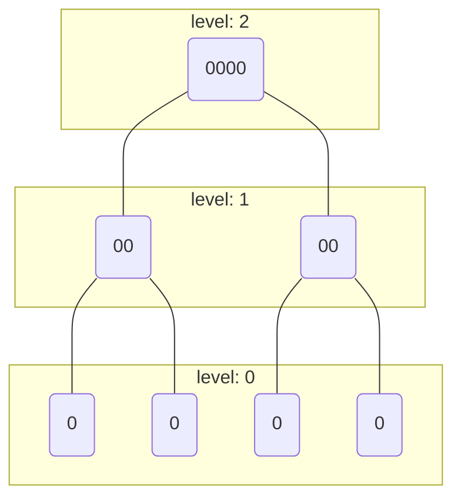
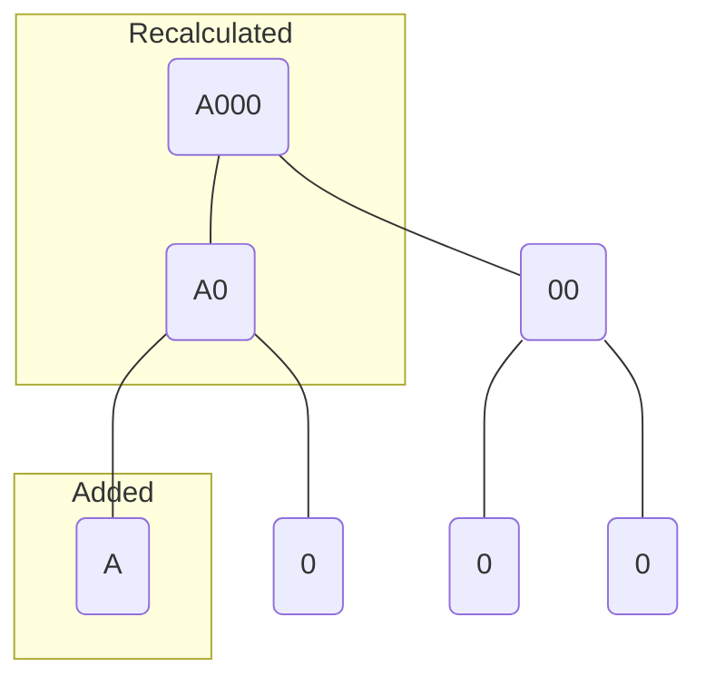
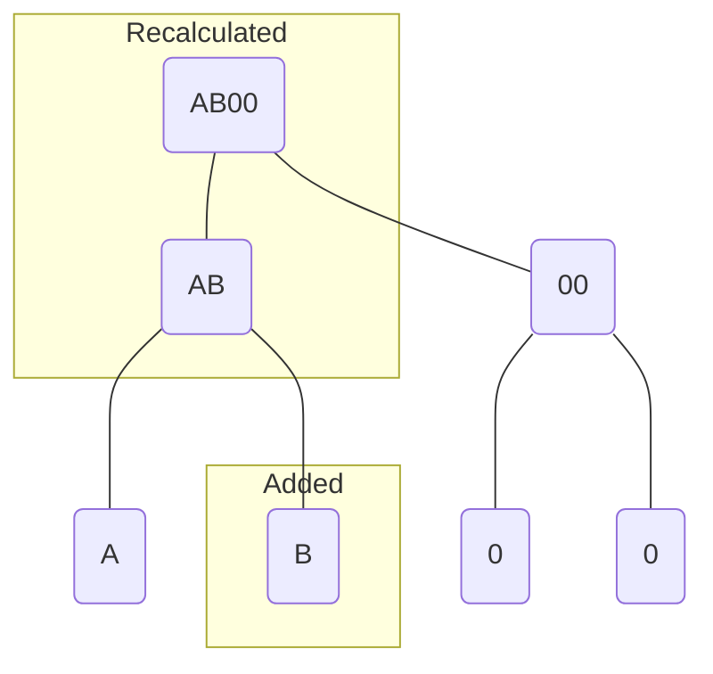
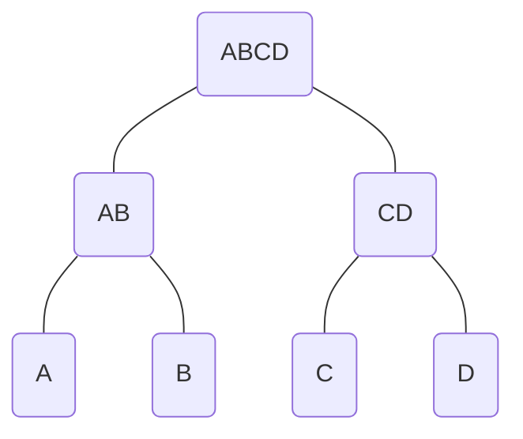

# Incremental Merkle Tree

This repository contains a Go implementation of an Incremental Merkle Tree (IMTs).

## The Algorithm

IMTs are perfect (balanced) binary trees. They allow us to recalcluate tree roots in polynomial time when new leaves are added. This is achieved by utilizing two, constant-sized slices of digests:
* the zero digest slice which is created on initialization and never updated; and
* the left-node digest slice which is built up from left-node digests as we add leaves and calculate digests towards the root.

The following depicts what the IMT would look like if we replaced `hash(left, right)` with `cat(left, right)` for the purposes of visualization.

On creation, all the leaves are zeroes. At this point, we have a slice which contains a single digest for every level of the tree. The tree has a height of 3 so our slice has 3 elements.

When we add a leaf (A), we recalculate the tree from the bottom-up. As we do this, we maintain a list of the digests of the left-sided nodes (A, and A0).

Adding another leaf (B) will cause the same subtree to be recalculated. We will rely on the list of left-sided node digests calculated from the previous step when leaf A was added.

After adding 4 leaves (A, B, C, and D), the tree has been completely recalculated.

